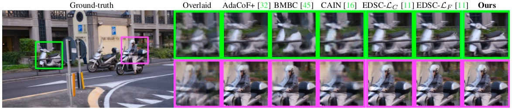

# CDFI (Compression-Driven-Frame-Interpolation)

[[Paper]()] (Coming soon...) | [[arXiv](https://arxiv.org/abs/2103.10559)]

[Tianyu Ding*](https://www.tianyuding.com), [Luming Liang*](https://scholar.google.com/citations?user=vTgdAS4AAAAJ&hl=en), [Zhihui Zhu](http://mysite.du.edu/~zzhu61/index.html), Ilya Zharkov

IEEE Conference on Computer Vision and Pattern Recognition (**CVPR**), 2021

## Introduction

We propose a **C**ompression-**D**riven network design for **F**rame **I**nterpolation (**CDFI**), that leverages model compression to significantly reduce the model size (allows a better understanding of the current architecture) while making room for further improvements and achieving superior performance in the end. Concretely, we first compress  [AdaCoF](https://openaccess.thecvf.com/content_CVPR_2020/html/Lee_AdaCoF_Adaptive_Collaboration_of_Flows_for_Video_Frame_Interpolation_CVPR_2020_paper.html) and show that a 10X compressed AdaCoF performs similarly as its original counterpart; then we improve upon this compressed model with simple modifications. *Note that typically it is prohibitive to implement the same improvements on the original heavy model.*

- We achieve a significant performance gain with only a quarter in size compared with the original AdaCoF

  |                    |            Vimeo-90K            |           Middlebury            |           UCF101-DVF            | #Params  |
  | :----------------: | :-----------------------------: | :-----------------------------: | :-----------------------------: | :---: |
  |                    |        PSNR, SSIM, LPIPS        |        PSNR, SSIM, LPIPS        |        PSNR, SSIM, LPIPS        |       |
  |       AdaCoF       |       34.35, 0.956, 0.019       |       35.72, 0.959, 0.019       |     35.16, **0.950**, 0.019     | 21.84M |
  | Compressed AdaCoF  |       34.10, 0.954, 0.020       |       35.43, 0.957, 0.018       |     35.10, **0.950**, 0.019     | 2.45M |
  |      AdaCoF+       |       34.56, 0.959, 0.018       |       36.09, 0.962, 0.017       |     35.16, **0.950**, 0.019     | 22.9M |
  | Compressed AdaCoF+ |       34.44, 0.958, 0.019       |       35.73, 0.960, 0.018       |     35.13, **0.950**, 0.019     | 2.56M |
  |  Our Final Model   | **35.17**, **0.964**, **0.010** | **37.14**, **0.966**, **0.007** | **35.21**, **0.950**, **0.015** | 4.98M |

- Our final model also performs favorably against other state-of-the-arts (details refer to our paper)

  

    
  

- The proposed framework is generic and can be easily transferred to other DNN-based frame interpolation method

  

The above GIF is a demo of using our method to generate slow motion video, which increases the FPS from 5 to 160. We also provide a long video demonstration [here](https://www.youtube.com/watch?v=KEUcw4xoB5E) (redirect to YouTube).

## Environment

- CUDA 11.0
- python 3.8.3

- torch 1.6.0
- torchvision 0.7.0
- cupy 7.7.0
- scipy 1.5.2
- numpy 1.19.1
- Pillow 7.2.0
- scikit-image 0.17.2

## Test Pre-trained Models

Download repository:

~~~bash
$ git clone https://github.com/tding1/CDFI.git
$ cd CDFI/
~~~

### Testing data

For user convenience, we already provide the [Middlebury](https://vision.middlebury.edu/flow/data/) and [UCF101-DVF](https://github.com/liuziwei7/voxel-flow) test datasets in our repository, which can be found under directory `test_data/`.

### Evaluation metrics

We use the built-in functions in `skimage.metrics` to compute the PSNR and SSIM, for which the higher the better. We also use [LPIPS](https://arxiv.org/abs/1801.03924), a newly proposed metric that measures perceptual similarity, for which the smaller the better. For user convenience, we include the implementation of LPIPS in our repo under `lpips_pytorch/`, which is a slightly modified version of [here](https://github.com/S-aiueo32/lpips-pytorch) (with an updated squeezenet backbone).

### Test our pre-trained CDFI model

~~~bash
$ python test.py --gpu_id 0
~~~

By default, it will load our pre-trained model  `checkpoints/CDFI_adacof.pth`. It will print the quantitative results on both Middlebury and UCF101-DVF, and the interpolated images will be saved under `test_output/cdfi_adacof/`.

### Test the compressed AdaCoF

~~~bash
$ python test_compressed_adacof.py --gpu_id 0 --kernel_size 5 --dilation 1
~~~

By default, it will load the compressed AdaCoF model  `checkpoints/compressed_adacof_F_5_D_1.pth`. It will print the quantitative results on both Middlebury and UCF101-DVF, and the interpolated images will be saved under `test_output/compressed_adacof_F_5_D_1/`.

### Test the compressed AdaCoF+

~~~bash
$ python test_compressed_adacof.py --gpu_id 0 --kernel_size 11 --dilation 2
~~~

By default, it will load the compressed AdaCoF+ model  `checkpoints/compressed_adacof_F_11_D_2.pth`. It will print the quantitative results on both Middlebury and UCF101-DVF, and the interpolated images will be saved under `test_output/compressed_adacof_F_11_D_2/`.

### Interpolate two frames

~~~bash
$ python interpolate_twoframe.py --gpu_id 0 --first_frame figs/0.png --second_frame figs/1.png --output_frame output.png
~~~

By default, it will load our pre-trained model  `checkpoints/CDFI_adacof.pth`, and generate the intermediate frame `output.png` given two consecutive frames in a sequence. 

## Train Our Model

### Training data

We use the [Vimeo-90K](https://arxiv.org/abs/1711.09078) triplet dataset for video frame interpolation task, which is relatively large (>32 GB).

~~~bash
$ wget http://data.csail.mit.edu/tofu/dataset/vimeo_triplet.zip
$ unzip vimeo_triplet.zip
$ rm vimeo_triplet.zip
~~~

### Start training

~~~bash
$ python train.py --gpu_id 0 --data_dir path/to/vimeo_triplet/ --batch_size 8
~~~

It will generate an unique ID for each training, and all the intermediate results/records will be saved under `model_weights/<training id>/`. For a GPU device with memory around 10GB, the `--batch_size` can take a value as large as 3, otherwise CUDA may be out of memory. There are many other training options, e.g., `--lr`, `--epochs`, `--loss` and so on, can be found in `train.py`.

## Apply CDFI to New Models

One nice thing about CDFI is that the framework can be easily applied to other (heavy) DNN models and potentially boost their performance. The key to CDFI is the *optimization-based* compression that compresses a model via fine-grained pruning. In particular, we use the efficient and easy-to-use sparsity-inducing optimizer [OBPROXSG](https://github.com/tianyic/obproxsg) (see also [paper](https://arxiv.org/abs/2004.03639)), and summarize the compression procedure for any other model in the following.

- Copy the [OBPROXSG optimizer](https://github.com/tianyic/obproxsg/blob/master/optimizer/obproxsg.py), which is already implemented as `torch.optim.optimizer`, to your working directory
- Starting from a pre-trained model, finetune its weights by using the OBPROXSG optimizer, like using any standard PyTorch built-in optimizer such as SGD or Adam
  - It is not necessarily to use the full dataset for this finetuning process
- The parameters for the OBPROXSG optimizer
  - `lr`: learning rate
  - `lambda_`: coefficient of the L1 regularization term
  - `epochSize`: number of batches in a epoch
  - `Np`: number of *proximal steps*, which is set to be 2 for pruning AdaCoF
  - `No`: number of *orthant* steps (key step to promote sparsity), for which we recommend using the default setting
  - `eps`: threshold for trimming zeros, which is set to be 0.0001 for pruning AdaCoF 
- After the optimization is done (either by reaching a maximum number of epochs or achieving a high sparsity), use the layer density as the compression ratio for that layer, as described in the paper
- As an example, compare the architectures in `models/adacof.py` and `model/compressed_adacof.py` for compressing AdaCoF with the above procedure

Now it's ready to make further improvements/modifications on the compressed model, based on the understanding of its flaws/drawbacks.

## Citation

~~~
@article{ding2021cdfi,
  title={CDFI: Compression-Driven Network Design for Frame Interpolation},
  author={Ding, Tianyu and Liang, Luming and Zhu, Zhihui and Zharkov, Ilya},
  journal={arXiv preprint arXiv:2103.10559},
  year={2021}
}
~~~

## Acknowledgements

The code is largely based on  [HyeongminLEE/AdaCoF-pytorch](https://github.com/HyeongminLEE/AdaCoF-pytorch) and [baowenbo/DAIN](https://github.com/baowenbo/DAIN).
